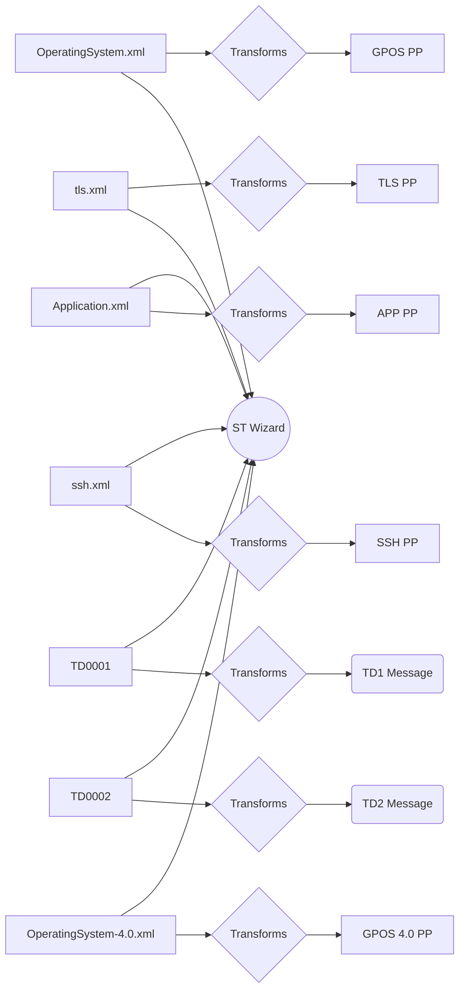

```mermaid
graph LR
    OSXML[OperatingSystem.xml] --> OST{Transforms} --> OSPP[GPOS PP]
    TLS_XML[tls.xml] --> TLS_T{Transforms} --> TLS_PP[TLS PP]

    TLS_XML --> STWIZ
    OSXML   --> STWIZ((ST Wizard))
    APP_XML --> STWIZ
    SSH_XML --> STWIZ
    TD1     --> STWIZ
    TD2         --> STWIZ
    OS_PREV_XML --> STWIZ

    SSH_XML[ssh.xml] --> SSH_T{Transforms} --> SSH_PP[SSH PP]
    APP_XML[Application.xml] --> APP_T{Transforms} --> APP_PP[APP PP]
    TD1[TD0001] --> TD1_T{Transforms} --> TD1_M(TD1 Message)
    TD2[TD0002] --> TD2_T{Transforms} --> TD2_M(TD2 Message)
    OS_PREV_XML[OperatingSystem-4.0.xml] --> OS4_T{Transforms} --> OS_4_PP[GPOS 4.0 PP]
```
